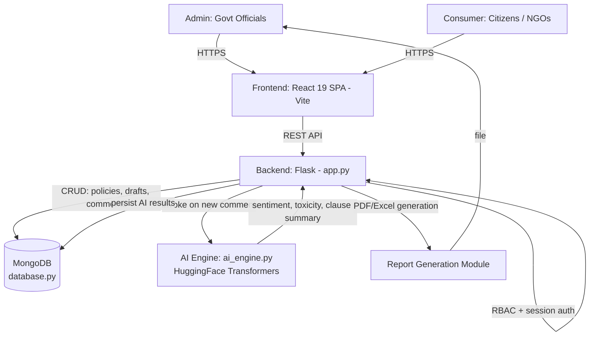
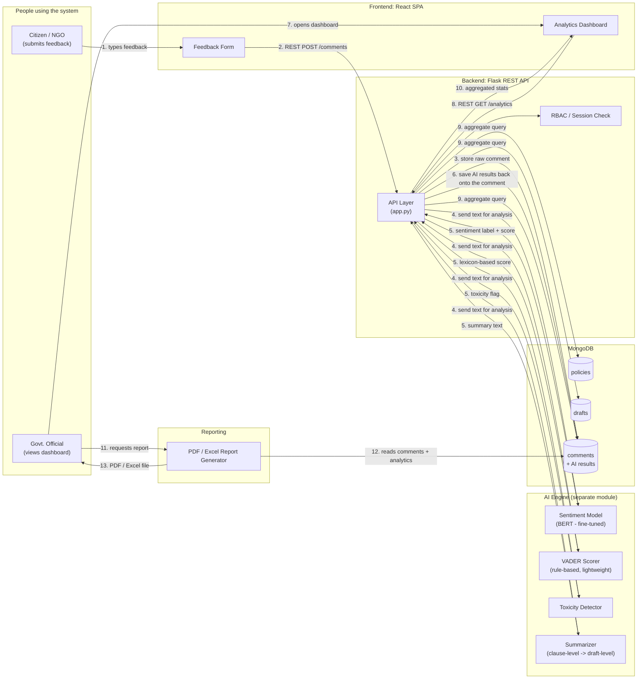
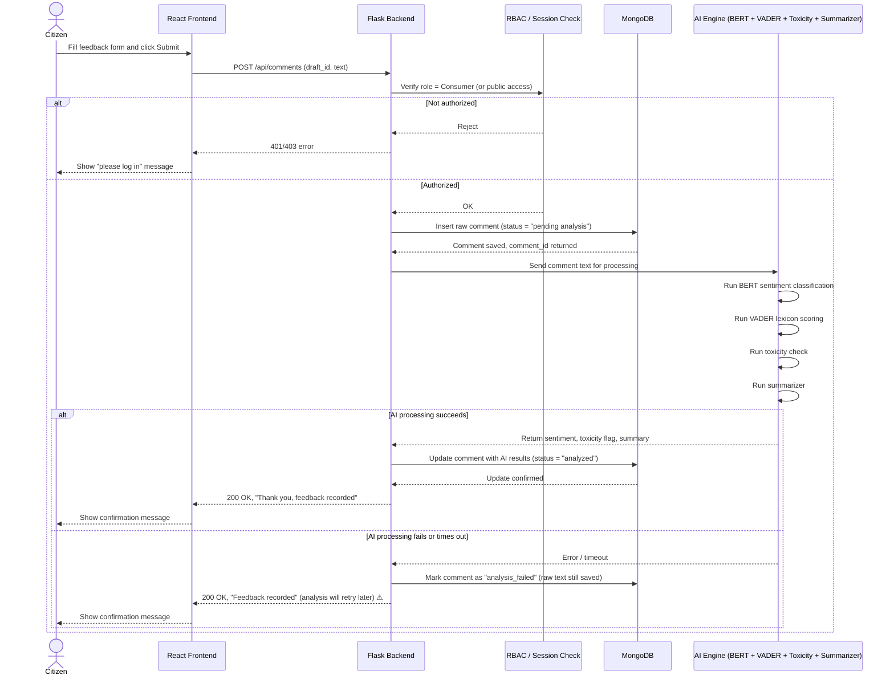

# Avalokan — System Architecture & Interview Q&A

## System Architecture Diagram

**Overview:** The React/Vite frontend talks to a Flask REST backend over HTTP for both admin (policy/draft management) and consumer (comment submission) roles, gated by RBAC/session auth. The backend persists the Policy → Draft → Comment hierarchy in MongoDB and calls a dedicated AI Engine (HuggingFace Transformers) for sentiment/toxicity/summarization on submitted comments, writing results back to MongoDB; the backend also generates PDF/Excel reports for admins.

---

## Interview Q&A

**Non-Technical**

1. **What does Avalokan do?**
   Helps a government ministry (MCA) analyze thousands of public comments on draft policies — sentiment, toxicity, and auto-summaries — instead of reading each manually.
2. **Who are the users?**
   Admins (government officials — create policies, manage drafts, view analytics, export reports) and Consumers (citizens/NGOs — submit feedback).
3. **Why is this useful for policymaking?**
   Converts unstructured public feedback into structured, actionable insight (sentiment trends, key concerns) at scale.
4. **What's the data hierarchy?**
   Policy → Draft (a specific version open for consultation) → Comment (citizen feedback tied to a draft).
5. **What happens when a policy is revised?**
   A new Draft is created under the same Policy; new drafts supersede older ones for active consultation.

**Technical**

6. **What's the full stack?**
   React 19 (Vite) frontend, Flask REST API backend, MongoDB database, separate AI Engine (HuggingFace Transformers).
7. **Why MongoDB over a relational DB here?**
   Comments/drafts have variable, nested, evolving structure (metadata, AI analysis fields) — document model fits better than rigid schema; supports flexible aggregation for analytics.
8. **What are the three main collections?**
   `policies`, `drafts`, `comments` — with comments referencing their parent draft.
9. **How does auth/RBAC work?**
   Allowlist-based Role-Based Access Control with session management in `app.py`; two roles — Admin (full policy/report access) and Consumer (submit + browse only).
10. **What does the AI Engine actually do?**
    Runs HuggingFace Transformer models for: sentiment classification, toxicity detection, and hierarchical/clause-wise summarization of comments.
11. **What is "hierarchical summarization"?**
    Summarizes feedback at the clause level first, then rolls up into a draft-level summary — preserves which specific clause got which feedback.
12. **How does frontend talk to backend?**
    REST API calls (HTTP/JSON) from the React SPA to Flask endpoints.
13. **How are reports generated?**
    A dedicated backend module generates PDF/Excel reports (aggregated analytics) for Admins to export.
14. **What happens step-by-step when a citizen submits a comment?**
    Frontend → REST POST to backend → backend validates + stores in `comments` collection → backend invokes AI Engine (sentiment/toxicity/summary) → results written back to the comment doc → available in Admin analytics.
15. **Why decouple the AI Engine from the main backend?**
    Separation of concerns — heavy ML inference (Transformers) is isolated from the lightweight REST/DB layer, easier to scale/replace independently.
16. **How is toxicity detection different from sentiment analysis here?**
    Sentiment = positive/negative/neutral stance; toxicity = flags abusive/harmful language — separate classifiers, both run on the same comment.
17. **What indexing/aggregation strategy would matter here?**
    Indexes on `draft_id` in comments (fast lookup per draft) and MongoDB aggregation pipelines for sentiment-distribution analytics per policy/draft.
18. **Why Vite for the frontend?**
    Fast dev server + build tool for React — quicker HMR (hot module reload) than older bundlers like CRA/Webpack.
19. **What's a scalability concern?**
    Synchronous AI inference inside the comment-submission request could bottleneck under high comment volume — better as an async/background job.
20. **What would you add next?**
    Async task queue for AI processing, versioned comment re-analysis on model updates, multi-language sentiment support.

==================================================================================================================================================================================================

# Avalokan — Data Flow & Control Flow (Beginner's Guide)

## 1. What is Avalokan, and why does it exist?

Imagine the government publishes a new draft policy and asks the public, "What do you think?" Thousands of citizens, NGOs, and businesses write in with comments. Someone now has to read every single comment, figure out whether it's positive, negative, or angry, and summarize the key concerns — by hand. That's slow, exhausting, and easy to get wrong.

**Avalokan** automates that job. It's a web platform built for the Ministry of Corporate Affairs (MCA) that:

- Lets citizens submit feedback on draft policies.
- Automatically reads each comment and figures out whether it's positive, negative, or neutral (this is called **sentiment analysis**).
- Flags harmful or abusive language (**toxicity detection**).
- Summarizes long feedback into short, digestible points.
- Gives government officials a dashboard to see all of this at a glance instead of reading every comment one by one.

Think of it as a very fast, tireless intern who reads every comment and hands the officials a neat summary.

**Note on assumptions:** This document reflects the documented implementation — a React frontend, a Flask backend, **MongoDB** as the database, and a separate AI engine using Hugging Face Transformer models (with your resume additionally noting BERT for classification and VADER as a secondary/rule-based sentiment scorer). Where anything below is inferred rather than confirmed, it's marked with ⚠.

---

## 2. Data Flow Diagram

This shows **where the data comes from and where it ends up** — not the order of actions, just the journey of information through the system.

### Plain-English walkthrough of the data flow

1. A **citizen or NGO** types feedback into a form on the website.
2. That text travels over the internet (as a REST API call) to the **Flask backend**.
3. The backend saves the **raw comment** into the **MongoDB database** immediately, so nothing is ever lost even if the AI step fails.
4. The backend then hands a copy of that same text to four different AI tools:
   - A **BERT-based model** that has been specifically trained to understand sentiment in policy/legal language.
   - **VADER**, a simpler, rule-based tool that scores sentiment using a dictionary of words and punctuation cues (fast, good for short comments).
   - A **toxicity detector** that checks for abusive or harmful language.
   - A **summarizer** that condenses long comments into short summaries, clause by clause.
5. Each tool sends its result back (a sentiment label, a toxicity flag, a short summary, etc.).
6. The backend attaches all these results to the original comment and updates it in the database — so now each comment "knows" its own sentiment, toxicity status, and summary.
7. Separately, a **government official** logs into the dashboard.
8. The dashboard asks the backend for analytics (e.g., "show me the sentiment breakdown for Draft #4").
9. The backend runs a database query that aggregates (counts and groups) the comment data.
10. The aggregated numbers (like "62% positive, 20% negative, 18% neutral") are sent back to the dashboard and displayed as charts.
11. If the official wants a formal document, they click "Generate Report."
12. The report module pulls the comments and analytics from the database.
13. It produces a downloadable PDF or Excel file.

---

## 3. Control Flow / Sequence Diagram

This shows the **order of steps and decision points** when a citizen submits a comment — i.e., what actually happens, in what order, when a button is clicked.

### Plain-English walkthrough of the control flow

1. The citizen fills out the feedback form and clicks **Submit**.
2. The React frontend sends this data to the backend as an API request.
3. The backend first checks: **is this person allowed to submit feedback?** (a permissions check, called RBAC — Role-Based Access Control).
   - If not authorized, the process stops here and the user sees an error.
   - If authorized, the flow continues.
4. The backend immediately **saves the raw comment** to the database — this is the safety net. Even if the AI step below breaks, the citizen's feedback is never lost.
5. The backend sends the comment text to the AI engine, which runs **four checks in sequence** (or in parallel, depending on implementation): sentiment (BERT), sentiment (VADER), toxicity, and summarization.
6. **If everything works:** the AI results come back, get attached to the saved comment, and the citizen sees a "Thank you" confirmation.
7. **If something goes wrong** (e.g., the AI service is down or too slow): the system doesn't lose the comment — it just marks it as "needs analysis later" and still tells the citizen their feedback was received. ⚠ This retry/fallback behavior is a reasonable assumption for a production system, but isn't explicitly documented — treat it as a design recommendation rather than a confirmed fact.
8. Either way, the citizen gets a fast response — they don't have to wait for the AI models to finish before seeing a confirmation (this is called **decoupling**: the slow AI work happens in the background, not directly in the citizen's waiting path). ⚠ Whether this is truly asynchronous or the citizen does wait a moment for AI results is an implementation detail not confirmed in the documentation.

---

## 4. Quick glossary (for absolute beginners)

- **REST API**: A common way for a website's frontend and backend to talk to each other, using simple web requests (like "GET this data" or "POST this new data").
- **Sentiment analysis**: Teaching a computer to guess whether a piece of text is happy, angry, sad, or neutral.
- **BERT**: A type of AI language model that reads text and understands context and meaning very well — like a very well-read assistant.
- **VADER**: A much simpler, faster tool that scores sentiment using a fixed dictionary of words and rules, without needing heavy computation.
- **Toxicity detection**: Checking if a comment contains abusive, hateful, or harmful language.
- **RBAC (Role-Based Access Control)**: A system for deciding what different types of users (citizens vs. officials) are allowed to do.
- **MongoDB**: A type of database that stores information as flexible documents (like JSON), which is convenient because comments and their AI results can have varying structures.

==================================================================================================================================================================================================

## Tech Stack

| Category | Component / Feature | Details, Versions, & File References |
| :--- | :--- | :--- |
| **Frontend** | **Language** | JavaScript with JSX |
| | **Framework** | React 19.2 |
| | **Build tool/dev server** | Vite 7.2+ |
| | **Routing** | React Router DOM 7.13 |
| | **HTTP client** | Axios 1.13 |
| | **Charts and visualization**| Recharts, D3, D3 Cloud, D3 Scale Chromatic |
| | **Animations** | Framer Motion |
| | **Icons** | Lucide React |
| | **Tooltips** | Tippy.js and @tippyjs/react |
| | **Styling** | CSS, Tailwind CSS 4.2, PostCSS, Autoprefixer |
| | **Linting** | ESLint 9 with React Hooks and React Refresh plugins |
| | **Module system** | ES modules |
| | **Frontend API origin** | Hardcoded backend URL at `http://localhost:5000` |
| | **Configuration** | Configured in `package.json:1-42` |
| **Backend** | **Language** | Python |
| | **Web framework** | Flask 3+ |
| | **CORS** | Flask-CORS |
| | **Authentication** | Flask sessions, Local email/password authentication, Google OAuth via Authlib, Werkzeug password hashing |
| | **Configuration** | python-dotenv |
| | **API style** | REST-style JSON endpoints |
| | **Server** | Flask development server |
| | **Entry point** | `app.py:1-70` |
| | **Dependencies** | Listed in `requirements.txt:1-15` |
| **Database** | **Database** | MongoDB |
| | **Python driver** | PyMongo |
| | **Default database** | `avalokan_db` |
| | **Default connection** | `mongodb://localhost:27017/avalokan_db` |
| | **Configurable through** | `MONGO_URI` (MongoDB Atlas can be used by setting `MONGO_URI` to an Atlas connection string) |
| | **Collections** | `policies`, `drafts`, `comments`, `draft_analysis`, `users` |
| | **Implementation** | Database configuration is implemented in `database.py:1-101` |
| **AI and NLP** | **PyTorch** | Model execution and CPU/GPU detection |
| | **Hugging Face Transformers**| NLP pipelines |
| | **TensorFlow Keras** | Compatibility via `tf-keras` |
| | **spaCy** | Keyword extraction and linguistic analysis |
| | **pandas** | Data processing |
| | **Models used** | **Sentiment:** `distilbert-base-uncased-finetuned-sst-2-english` **Toxicity:** `unitary/toxic-bert` **Summarization:** `t5-small` **Hierarchical summarization:** `sshleifer/distilbart-cnn-12-6` **Optional spaCy model:** `en_core_web_sm` |
| | **Implementation & Storage**| AI logic is implemented in `ai_engine.py:1-120`. Models are downloaded and cached locally under `.model_cache`. |
| **Reporting & Data Export**| **PDF reports** | ReportLab |
| | **Excel reports** | pandas and OpenPyXL |
| | **Charts/data preparation** | pandas and Matplotlib |
| | **Test/demo data** | Faker |
| | **Relevant files** | `report_generator.py`, `excel_generator.py` |
| | **Dependency Note** | `openpyxl` is used by the Excel generator but is not explicitly listed in `requirements.txt`, so it should be added for reliable fresh-environment setup. |
| **Configuration & Infrastructure**| **Environment variables** | Documented in `.env.example`: `FLASK_SECRET_KEY` `FLASK_HOST` `FLASK_PORT` `FLASK_DEBUG` `FRONTEND_URL` `CORS_ORIGINS` `MONGO_URI` `GOOGLE_CLIENT_ID` `GOOGLE_CLIENT_SECRET` `ADMIN_ALLOWLIST` |
| **Runtime Requirements**| **System Dependencies** | Node.js and npm, Python |
| | **Database Requirement** | MongoDB local server or MongoDB Atlas |
| | **Network Requirement** | Internet access on first AI model execution |
| | **Hardware & Credentials**| Optional GPU for faster AI inference, Google OAuth credentials for Google login |
| **Not Currently Present**| **Missing Capabilities** | TypeScript, Docker configuration, Docker Compose, Automated CI/CD configuration, Backend test suite, Frontend test framework, Production WSGI server such as Gunicorn or Waitress, Explicit Python or Node version files |
| **Summary** | **In short** | Avalokan is a React/Vite single-page application backed by a Flask REST API, MongoDB, Hugging Face/PyTorch NLP services, Google OAuth, and PDF/Excel reporting tools. |
