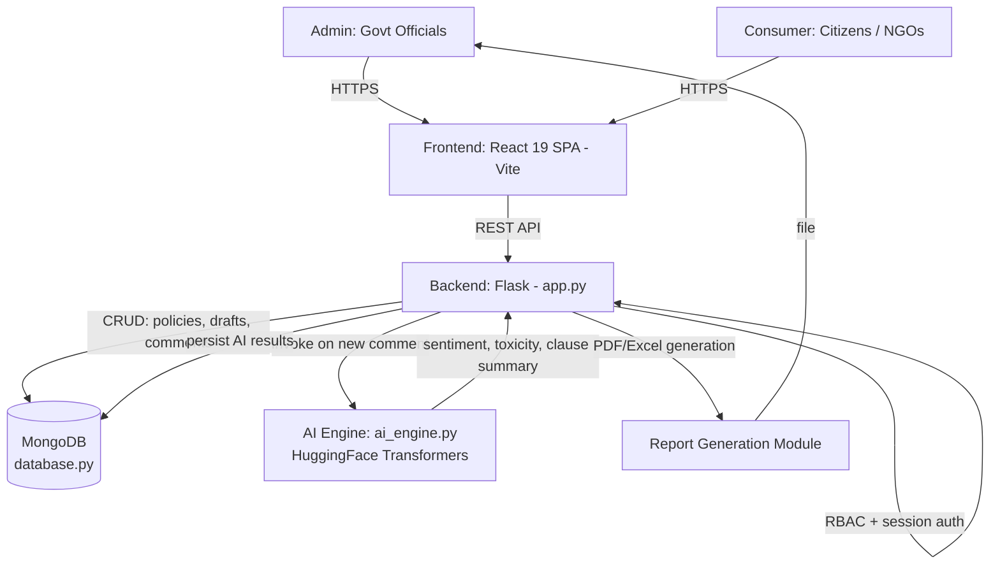
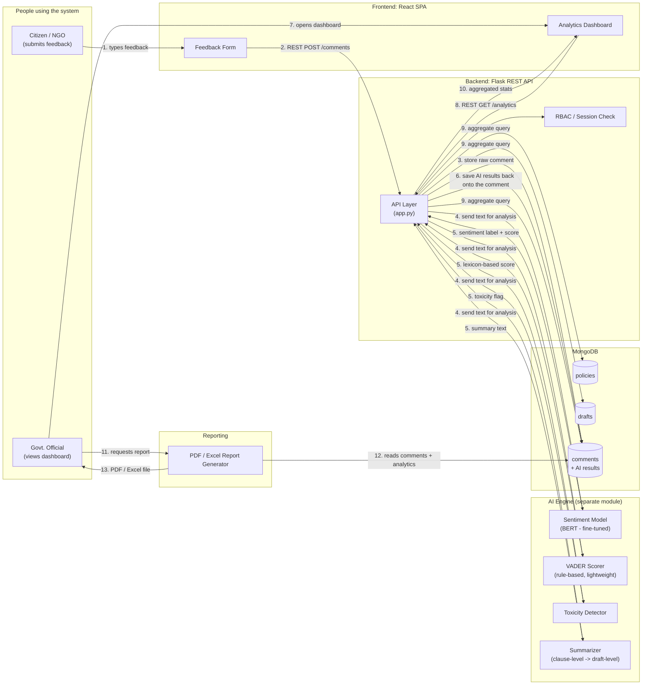
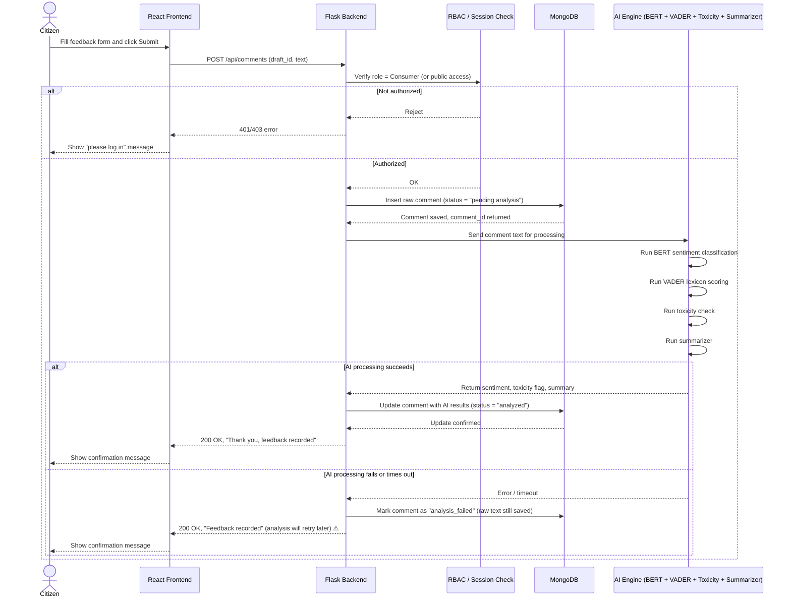

# Avalokan — System Architecture & Interview Q&A

## System Architecture Diagram

**Overview:** The React/Vite frontend talks to a Flask REST backend over HTTP for both admin (policy/draft management) and consumer (comment submission) roles, gated by RBAC/session auth. The backend persists the Policy → Draft → Comment hierarchy in MongoDB and calls a dedicated AI Engine (HuggingFace Transformers) for sentiment/toxicity/summarization on submitted comments, writing results back to MongoDB; the backend also generates PDF/Excel reports for admins.

---

## Interview Q&A

**Non-Technical**

1. **What does Avalokan do?**
   Helps a government ministry (MCA) analyze thousands of public comments on draft policies — sentiment, toxicity, and auto-summaries — instead of reading each manually.
2. **Who are the users?**
   Admins (government officials — create policies, manage drafts, view analytics, export reports) and Consumers (citizens/NGOs — submit feedback).
3. **Why is this useful for policymaking?**
   Converts unstructured public feedback into structured, actionable insight (sentiment trends, key concerns) at scale.
4. **What's the data hierarchy?**
   Policy → Draft (a specific version open for consultation) → Comment (citizen feedback tied to a draft).
5. **What happens when a policy is revised?**
   A new Draft is created under the same Policy; new drafts supersede older ones for active consultation.

**Technical**

6. **What's the full stack?**
   React 19 (Vite) frontend, Flask REST API backend, MongoDB database, separate AI Engine (HuggingFace Transformers).
7. **Why MongoDB over a relational DB here?**
   Comments/drafts have variable, nested, evolving structure (metadata, AI analysis fields) — document model fits better than rigid schema; supports flexible aggregation for analytics.
8. **What are the three main collections?**
   `policies`, `drafts`, `comments` — with comments referencing their parent draft.
9. **How does auth/RBAC work?**
   Allowlist-based Role-Based Access Control with session management in `app.py`; two roles — Admin (full policy/report access) and Consumer (submit + browse only).
10. **What does the AI Engine actually do?**
    Runs HuggingFace Transformer models for: sentiment classification, toxicity detection, and hierarchical/clause-wise summarization of comments.
11. **What is "hierarchical summarization"?**
    Summarizes feedback at the clause level first, then rolls up into a draft-level summary — preserves which specific clause got which feedback.
12. **How does frontend talk to backend?**
    REST API calls (HTTP/JSON) from the React SPA to Flask endpoints.
13. **How are reports generated?**
    A dedicated backend module generates PDF/Excel reports (aggregated analytics) for Admins to export.
14. **What happens step-by-step when a citizen submits a comment?**
    Frontend → REST POST to backend → backend validates + stores in `comments` collection → backend invokes AI Engine (sentiment/toxicity/summary) → results written back to the comment doc → available in Admin analytics.
15. **Why decouple the AI Engine from the main backend?**
    Separation of concerns — heavy ML inference (Transformers) is isolated from the lightweight REST/DB layer, easier to scale/replace independently.
16. **How is toxicity detection different from sentiment analysis here?**
    Sentiment = positive/negative/neutral stance; toxicity = flags abusive/harmful language — separate classifiers, both run on the same comment.
17. **What indexing/aggregation strategy would matter here?**
    Indexes on `draft_id` in comments (fast lookup per draft) and MongoDB aggregation pipelines for sentiment-distribution analytics per policy/draft.
18. **Why Vite for the frontend?**
    Fast dev server + build tool for React — quicker HMR (hot module reload) than older bundlers like CRA/Webpack.
19. **What's a scalability concern?**
    Synchronous AI inference inside the comment-submission request could bottleneck under high comment volume — better as an async/background job.
20. **What would you add next?**
    Async task queue for AI processing, versioned comment re-analysis on model updates, multi-language sentiment support.

==================================================================================================================================================================================================

# Avalokan — Data Flow & Control Flow (Beginner's Guide)

## 1. What is Avalokan, and why does it exist?

Imagine the government publishes a new draft policy and asks the public, "What do you think?" Thousands of citizens, NGOs, and businesses write in with comments. Someone now has to read every single comment, figure out whether it's positive, negative, or angry, and summarize the key concerns — by hand. That's slow, exhausting, and easy to get wrong.

**Avalokan** automates that job. It's a web platform built for the Ministry of Corporate Affairs (MCA) that:

- Lets citizens submit feedback on draft policies.
- Automatically reads each comment and figures out whether it's positive, negative, or neutral (this is called **sentiment analysis**).
- Flags harmful or abusive language (**toxicity detection**).
- Summarizes long feedback into short, digestible points.
- Gives government officials a dashboard to see all of this at a glance instead of reading every comment one by one.

Think of it as a very fast, tireless intern who reads every comment and hands the officials a neat summary.

**Note on assumptions:** This document reflects the documented implementation — a React frontend, a Flask backend, **MongoDB** as the database, and a separate AI engine using Hugging Face Transformer models (with your resume additionally noting BERT for classification and VADER as a secondary/rule-based sentiment scorer). Where anything below is inferred rather than confirmed, it's marked with ⚠.

---

## 2. Data Flow Diagram

This shows **where the data comes from and where it ends up** — not the order of actions, just the journey of information through the system.

### Plain-English walkthrough of the data flow

1. A **citizen or NGO** types feedback into a form on the website.
2. That text travels over the internet (as a REST API call) to the **Flask backend**.
3. The backend saves the **raw comment** into the **MongoDB database** immediately, so nothing is ever lost even if the AI step fails.
4. The backend then hands a copy of that same text to four different AI tools:
   - A **BERT-based model** that has been specifically trained to understand sentiment in policy/legal language.
   - **VADER**, a simpler, rule-based tool that scores sentiment using a dictionary of words and punctuation cues (fast, good for short comments).
   - A **toxicity detector** that checks for abusive or harmful language.
   - A **summarizer** that condenses long comments into short summaries, clause by clause.
5. Each tool sends its result back (a sentiment label, a toxicity flag, a short summary, etc.).
6. The backend attaches all these results to the original comment and updates it in the database — so now each comment "knows" its own sentiment, toxicity status, and summary.
7. Separately, a **government official** logs into the dashboard.
8. The dashboard asks the backend for analytics (e.g., "show me the sentiment breakdown for Draft #4").
9. The backend runs a database query that aggregates (counts and groups) the comment data.
10. The aggregated numbers (like "62% positive, 20% negative, 18% neutral") are sent back to the dashboard and displayed as charts.
11. If the official wants a formal document, they click "Generate Report."
12. The report module pulls the comments and analytics from the database.
13. It produces a downloadable PDF or Excel file.

---

## 3. Control Flow / Sequence Diagram

This shows the **order of steps and decision points** when a citizen submits a comment — i.e., what actually happens, in what order, when a button is clicked.

### Plain-English walkthrough of the control flow

1. The citizen fills out the feedback form and clicks **Submit**.
2. The React frontend sends this data to the backend as an API request.
3. The backend first checks: **is this person allowed to submit feedback?** (a permissions check, called RBAC — Role-Based Access Control).
   - If not authorized, the process stops here and the user sees an error.
   - If authorized, the flow continues.
4. The backend immediately **saves the raw comment** to the database — this is the safety net. Even if the AI step below breaks, the citizen's feedback is never lost.
5. The backend sends the comment text to the AI engine, which runs **four checks in sequence** (or in parallel, depending on implementation): sentiment (BERT), sentiment (VADER), toxicity, and summarization.
6. **If everything works:** the AI results come back, get attached to the saved comment, and the citizen sees a "Thank you" confirmation.
7. **If something goes wrong** (e.g., the AI service is down or too slow): the system doesn't lose the comment — it just marks it as "needs analysis later" and still tells the citizen their feedback was received. ⚠ This retry/fallback behavior is a reasonable assumption for a production system, but isn't explicitly documented — treat it as a design recommendation rather than a confirmed fact.
8. Either way, the citizen gets a fast response — they don't have to wait for the AI models to finish before seeing a confirmation (this is called **decoupling**: the slow AI work happens in the background, not directly in the citizen's waiting path). ⚠ Whether this is truly asynchronous or the citizen does wait a moment for AI results is an implementation detail not confirmed in the documentation.

---

## 4. Quick glossary (for absolute beginners)

- **REST API**: A common way for a website's frontend and backend to talk to each other, using simple web requests (like "GET this data" or "POST this new data").
- **Sentiment analysis**: Teaching a computer to guess whether a piece of text is happy, angry, sad, or neutral.
- **BERT**: A type of AI language model that reads text and understands context and meaning very well — like a very well-read assistant.
- **VADER**: A much simpler, faster tool that scores sentiment using a fixed dictionary of words and rules, without needing heavy computation.
- **Toxicity detection**: Checking if a comment contains abusive, hateful, or harmful language.
- **RBAC (Role-Based Access Control)**: A system for deciding what different types of users (citizens vs. officials) are allowed to do.
- **MongoDB**: A type of database that stores information as flexible documents (like JSON), which is convenient because comments and their AI results can have varying structures.

==================================================================================================================================================================================================

## Tech Stack

| Category | Component / Feature | Details, Versions, & File References |
| :--- | :--- | :--- |
| **Frontend** | **Language** | JavaScript with JSX |
| | **Framework** | React 19.2 |
| | **Build tool/dev server** | Vite 7.2+ |
| | **Routing** | React Router DOM 7.13 |
| | **HTTP client** | Axios 1.13 |
| | **Charts and visualization**| Recharts, D3, D3 Cloud, D3 Scale Chromatic |
| | **Animations** | Framer Motion |
| | **Icons** | Lucide React |
| | **Tooltips** | Tippy.js and @tippyjs/react |
| | **Styling** | CSS, Tailwind CSS 4.2, PostCSS, Autoprefixer |
| | **Linting** | ESLint 9 with React Hooks and React Refresh plugins |
| | **Module system** | ES modules |
| | **Frontend API origin** | Hardcoded backend URL at `http://localhost:5000` |
| | **Configuration** | Configured in `package.json:1-42` |
| **Backend** | **Language** | Python |
| | **Web framework** | Flask 3+ |
| | **CORS** | Flask-CORS |
| | **Authentication** | Flask sessions, Local email/password authentication, Google OAuth via Authlib, Werkzeug password hashing |
| | **Configuration** | python-dotenv |
| | **API style** | REST-style JSON endpoints |
| | **Server** | Flask development server |
| | **Entry point** | `app.py:1-70` |
| | **Dependencies** | Listed in `requirements.txt:1-15` |
| **Database** | **Database** | MongoDB |
| | **Python driver** | PyMongo |
| | **Default database** | `avalokan_db` |
| | **Default connection** | `mongodb://localhost:27017/avalokan_db` |
| | **Configurable through** | `MONGO_URI` (MongoDB Atlas can be used by setting `MONGO_URI` to an Atlas connection string) |
| | **Collections** | `policies`, `drafts`, `comments`, `draft_analysis`, `users` |
| | **Implementation** | Database configuration is implemented in `database.py:1-101` |
| **AI and NLP** | **PyTorch** | Model execution and CPU/GPU detection |
| | **Hugging Face Transformers**| NLP pipelines |
| | **TensorFlow Keras** | Compatibility via `tf-keras` |
| | **spaCy** | Keyword extraction and linguistic analysis |
| | **pandas** | Data processing |
| | **Models used** | **Sentiment:** `distilbert-base-uncased-finetuned-sst-2-english` **Toxicity:** `unitary/toxic-bert` **Summarization:** `t5-small` **Hierarchical summarization:** `sshleifer/distilbart-cnn-12-6` **Optional spaCy model:** `en_core_web_sm` |
| | **Implementation & Storage**| AI logic is implemented in `ai_engine.py:1-120`. Models are downloaded and cached locally under `.model_cache`. |
| **Reporting & Data Export**| **PDF reports** | ReportLab |
| | **Excel reports** | pandas and OpenPyXL |
| | **Charts/data preparation** | pandas and Matplotlib |
| | **Test/demo data** | Faker |
| | **Relevant files** | `report_generator.py`, `excel_generator.py` |
| | **Dependency Note** | `openpyxl` is used by the Excel generator but is not explicitly listed in `requirements.txt`, so it should be added for reliable fresh-environment setup. |
| **Configuration & Infrastructure**| **Environment variables** | Documented in `.env.example`: `FLASK_SECRET_KEY` `FLASK_HOST` `FLASK_PORT` `FLASK_DEBUG` `FRONTEND_URL` `CORS_ORIGINS` `MONGO_URI` `GOOGLE_CLIENT_ID` `GOOGLE_CLIENT_SECRET` `ADMIN_ALLOWLIST` |
| **Runtime Requirements**| **System Dependencies** | Node.js and npm, Python |
| | **Database Requirement** | MongoDB local server or MongoDB Atlas |
| | **Network Requirement** | Internet access on first AI model execution |
| | **Hardware & Credentials**| Optional GPU for faster AI inference, Google OAuth credentials for Google login |
| **Not Currently Present**| **Missing Capabilities** | TypeScript, Docker configuration, Docker Compose, Automated CI/CD configuration, Backend test suite, Frontend test framework, Production WSGI server such as Gunicorn or Waitress, Explicit Python or Node version files |
| **Summary** | **In short** | Avalokan is a React/Vite single-page application backed by a Flask REST API, MongoDB, Hugging Face/PyTorch NLP services, Google OAuth, and PDF/Excel reporting tools. |

==================================================================================================================================================================================================

# 🛠️ My Contributions — Avalokan

 

## 🔵 Part 2 — Avalokan

### 🎯 The headline answer (what I'd say first)

> *"On Avalokan, I built the **complete website frontend**, **seeded the database and helped design the schema**, and wrote the **logic connecting BERT, VADER, and the summarization models** — so that raw citizen feedback turns into sentiment scores and readable summaries — and then wired those generated summaries into the **reports section** that officials actually see."*

### 📦 Breakdown by contribution area

<table>
<tr><td>🖥️ <b>Frontend</b></td><td>Full React (Vite) website — citizen feedback forms and the admin-facing views.</td></tr>
<tr><td>🗄️ <b>Database</b></td><td>Helped design the MongoDB schema (<code>policies</code> → <code>drafts</code> → <code>comments</code>) and seeded it with initial data.</td></tr>
<tr><td>🤖 <b>AI Logic</b></td><td>Wrote the glue logic connecting BERT + VADER sentiment scoring and the summarization model to real comment data.</td></tr>
<tr><td>📊 <b>Reports</b></td><td>Connected the generated AI summaries into the report-generation section for admins.</td></tr>
</table>

---

### 🖥️ Frontend — Detailed Talking Points

> *"I built the whole React frontend — the citizen-facing feedback form and the admin dashboard that shows sentiment breakdowns and summaries."*

<b>❓ Why React + Vite for this project?</b>

React gives component reusability for the two very different views (citizen form vs. admin analytics), and Vite gives fast dev-server reloads, which mattered for quick iteration during a hackathon/project timeline.

<b>❓ What are the main pages/views you built?</b>

A feedback submission form for citizens/NGOs (tied to a specific policy draft), and an admin dashboard showing per-draft sentiment breakdowns, flagged/toxic comments, and generated summaries.

<b>❓ How does the frontend know which "draft" a comment belongs to?</b>

Each draft has an ID; the feedback form is loaded in the context of a specific draft (e.g., via a route/URL parameter) and submits the comment tagged with that `draft_id`.

<b>❓ How did you handle state/data fetching in React?</b>

Standard React state/hooks for local UI state, with REST calls to the Flask backend for fetching policies/drafts/comments and posting new feedback.

<b>❓ What was the trickiest UI piece?</b>

Displaying the hierarchical summary clearly — showing which specific clause of a draft got which sentiment/summary, without overwhelming the admin with raw comment text.

<b>❓ Did you handle authentication/roles in the frontend?</b>

Yes — the frontend respects the two roles (Admin vs. Consumer) coming from the backend's session/RBAC layer, showing/hiding the analytics and report-generation views accordingly.

<b>❓ How would you improve the frontend if you had more time?</b>

Add optimistic UI updates on comment submission (so the citizen sees instant feedback instead of waiting on the full AI pipeline), and richer data visualizations (sentiment trend over time, not just a snapshot).

---

### 🗄️ Database Design & Seeding — Detailed Talking Points

> *"I helped design the schema around three collections — policies, drafts, and comments — and wrote the seed data so the team had realistic sample data to build and test against from day one."*

<b>❓ Why MongoDB instead of a relational database here?</b>

Comments carry variable, evolving structure — raw text plus AI-generated fields (sentiment score, toxicity flag, summary) that can differ or grow over time — a flexible document store fits that better than a rigid predefined schema.

<b>❓ Describe the three collections and how they relate.</b>

`policies` are the top-level topic; each policy has one or more `drafts` (versions open for consultation); each `draft` has many `comments`, each comment referencing its parent draft's ID.

<b>❓ What fields does a comment document actually have?</b>

Raw text, submitter info, timestamp, draft reference, plus AI-added fields: sentiment label/score, toxicity flag, and summary — the AI fields get written back onto the same document after processing.

<b>❓ Why did seeding the database matter?</b>

Without realistic seed data (sample policies, drafts, and a spread of comments with varied sentiment), the frontend and AI integration couldn't be properly tested end-to-end before real citizen data existed.

<b>❓ What did you seed, specifically?</b>

*(Answer with your real specifics — e.g.: sample policy documents, a few draft versions per policy, and a batch of realistic comments spanning positive/negative/neutral/toxic examples to stress-test the AI pipeline and dashboard views.)*

<b>❓ How would you index this for performance at scale?</b>

Index `draft_id` on the comments collection (since every dashboard query filters by draft), and consider a compound index on `draft_id` + sentiment label for fast aggregate breakdowns.

<b>❓ What's a schema design trade-off you made?</b>

Storing AI results directly on the comment document (rather than in a separate collection) — simpler to query and display per comment, at the cost of the comment document growing larger and needing re-writes if a model is re-run later.

---

### 🤖 BERT + VADER + Summarization Logic — Detailed Talking Points

> *"This was my core AI-integration piece — taking the raw comment text and running it through BERT for contextual sentiment, VADER as a fast secondary/lexicon-based score, and a summarization step, then writing all of that back onto the comment record."*

<b>❓ Why use both BERT and VADER instead of just one?</b>

BERT understands context and domain jargon much better (important for legal/policy language), while VADER is lightweight, fast, and good at short, punctuation/emoji-heavy text — using both gives a context-aware score plus a fast sanity-check/secondary signal.

<b>❓ How do you reconcile it if BERT and VADER disagree on a comment's sentiment?</b>

*(Answer based on your actual logic — e.g.: BERT's contextual score is treated as primary since it's fine-tuned on domain data, and VADER's score is surfaced as a secondary signal/sanity check rather than overriding it, or you took a weighted combination — describe whichever you implemented.)*

<b>❓ What does "fine-tuned" mean for the BERT model here, concretely?</b>

The base BERT model's weights were further trained on labeled policy-feedback examples so it learns domain-specific vocabulary and phrasing, rather than relying only on its generic pretraining.

<b>❓ Walk me through the logic pipeline for one incoming comment.</b>

1. Comment text arrives at the backend.
2. Backend calls my sentiment logic, which tokenizes the text and runs it through the fine-tuned BERT model for a contextual sentiment label/score.
3. VADER independently scores the same text using its lexicon/rule approach.
4. A toxicity check runs alongside.
5. The summarization step condenses the comment (working at clause level for longer text) into a short summary.
6. All of these results get written back onto the comment document in MongoDB.

<b>❓ How does "batched tokenization" work and why does it matter?</b>

Instead of running the model once per comment, multiple comments are tokenized and passed through the model together as a batch — this is significantly faster on the same hardware than looping one comment at a time, since it makes better use of parallel computation.

<b>❓ What does "drift monitoring" mean and how would you implement it here?</b>

Tracking whether the distribution of incoming comment language/sentiment shifts meaningfully over time (e.g., new policy topics introducing vocabulary the model wasn't trained on) — implemented by periodically comparing recent prediction confidence/distribution against a baseline, flagging when accuracy might be degrading and retraining is needed.

<b>❓ How did you connect the AI models to the actual application (not just run them standalone)?</b>

I wrote the integration logic that takes a comment straight from the database/API request, prepares it for each model (tokenization, formatting), calls the models, and maps their raw outputs into the clean fields (`sentiment`, `toxicity_flag`, `summary`) stored back on the comment record.

<b>❓ What happens if the AI step fails or times out for a comment?</b>

The raw comment is already saved before AI processing runs, so citizen feedback is never lost even if the model call fails — the comment can be marked for retry rather than blocking the citizen's submission.

<b>❓ Why summarize at the "clause level" instead of the whole comment at once?</b>

Long feedback often reacts to multiple different clauses of a draft policy — summarizing per clause keeps that context, so admins can see which specific clause each summary point relates to, instead of one blended summary losing that mapping.

<b>❓ How would you evaluate whether your sentiment logic is actually accurate?</b>

Compare model predictions against a manually labeled validation set of comments and compute accuracy/precision/recall per sentiment class, paying particular attention to domain jargon cases where generic models tend to fail.

<b>❓ What's a limitation of your current AI logic pipeline?</b>

It runs synchronously as part of the comment-submission request in the current design, which could become a bottleneck under high comment volume — a background job queue would be a natural next step.

---

### 📊 Connecting Summaries to Reports — Detailed Talking Points

> *"Once comments had sentiment and summary data attached, I built the logic that pulls that data into the reports section — so an official could generate a PDF/Excel report showing aggregated sentiment and the AI-generated summaries per draft, not just raw comment dumps."*

<b>❓ What exactly goes into a generated report?</b>

Aggregated sentiment breakdown (e.g., % positive/negative/neutral) per draft, flagged/toxic comment counts, and the AI-generated clause-level summaries — giving an official a full picture without reading every comment.

<b>❓ How did you pull the summaries into the report generator technically?</b>

The report module queries the comments collection for a given draft, reads the already-computed `summary` and `sentiment` fields off each comment (since they're precomputed and stored, not recalculated on the fly), and aggregates/formats them into the output document.

<b>❓ Why store summaries on the comment rather than compute them fresh every time a report is generated?</b>

Precomputing avoids re-running expensive model inference every time someone wants a report — reports can be generated instantly from already-processed data instead of waiting on the AI pipeline again.

<b>❓ What format(s) can reports be exported in?</b>

PDF and Excel — giving officials both a shareable/readable format and a format they can further analyze or filter in a spreadsheet.

<b>❓ How would reports need to change if a comment's AI analysis were updated/re-run later (e.g., a model upgrade)?</b>

The stored `summary`/`sentiment` fields on the comment would need to be refreshed, and any previously generated reports would reflect the older analysis unless regenerated — a versioning strategy on AI results would help track this cleanly.

<b>❓ What was the hardest part of wiring summaries into reports?</b>

Keeping the clause-level granularity intact through aggregation — it's easy to accidentally flatten everything into one generic summary, losing the "which clause got which feedback" detail that makes the report actually useful to policymakers.

---

### 🌐 Cross-cutting Avalokan questions

<b>❓ Of everything you built, what are you most proud of and why?</b>

Connecting the AI layer (BERT/VADER/summarization) all the way through to the reports section — it's the piece that actually turns "we ran some ML models" into a usable end product an official can act on.

<b>❓ What was the biggest bug or issue you personally hit?</b>

*(Have a real, specific one ready — e.g., an early version double-counted sentiment because both BERT and VADER results were briefly stored under the same field name, silently overwriting one another; fixed by giving each model its own explicit field.)*

<b>❓ Which part of Avalokan did you NOT build?</b>

The Flask backend's core REST API structure and RBAC/session auth layer were built by teammates — I focused on the frontend, DB schema/seeding, the AI-model integration logic, and wiring that into reports.

<b>❓ How did your piece depend on teammates' work, and vice versa?</b>

My AI integration logic needed the backend's comment-submission endpoint and MongoDB connection already in place to have somewhere to write results, and the reports module I connected needed the backend's report-generation scaffolding to exist first.

<b>❓ If you had to explain your contribution in one sentence to a non-technical interviewer?</b>

"I built the website people actually see and use, made sure the data behind it was structured and populated correctly, and made the AI 'understand' feedback and hand that understanding straight into the reports officials read."

---

### ✅ Prep checklist before the interview

- [ ] Fill in the two "have a real bug ready" placeholders above with your actual debugging story.
- [ ] Fill in the "what did you seed, specifically" answer with real sample data details.
- [ ] Confirm the BERT-vs-VADER reconciliation logic matches what you actually implemented.
- [ ] Practice saying the headline answer for each project out loud, twice, without reading it.
